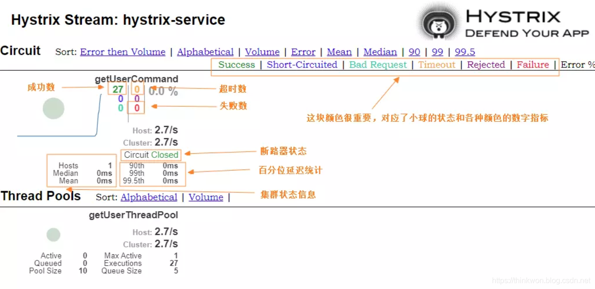

# fang-root
个人练手测试项目
#本项目旨在熟练 springcloud 全家桶。根据springcloud 的相关组件逐一新建相关模块进行代码开发测试。
1、为何要学习Spring cloud 
- 随着业务逐渐发展，产品思想会变得越来越复杂，单体结构的应用也会越来越复杂，微服务架构逐渐取代了单体架构，且这种趋势将会越来越流行。Spring Cloud是目前最常用的微服务开发框架，已经在企业级开发中大量的应用。

2、什么是Spring Cloud
- Spring Cloud是一系列框架的有序集合。它利用Spring Boot的开发便利性巧妙地简化了分布式系统基础设施的开发，如服务发现注册、配置中心、智能路由、消息总线、负载均衡、断路器、数据监控等，都可以用Spring Boot的开发风格做到一键启动和部署。通过Spring Boot风格进行再封装屏蔽掉了复杂的配置和实现原理，最终给开发者留出了一套简单易懂、易部署和易维护的分布式系统开发工具包。

3、设计目标与优缺点
 
- 3.1 目标：旨在协调各个微服务，简化分布式系统开发。
- 3.2 优缺点： 
  
   - 3.2.1  微服务的框架那么多比如：dubbo、Kubernetes，为什么就要使用Spring Cloud的呢？
   
   - 3.2.2  优点：
  
      - 产出于Spring大家族，Spring在企业级开发框架中无人能敌，来头很大，可以保证后续的更新、完善
      
      - 轻轻松松几行代码，注解或者配置就完成了熔断、负载均衡、注册中心的各种平台功能
      
      - Spring Cloud 社区活跃度很高，教程很丰富，遇到问题很容易找到解决方案
      
      - 服务拆分粒度更细，耦合度比较低，有利于资源重复利用，有利于提高开发效率
      
      - 可以更精准的制定优化服务方案，提高系统的可维护性
      
      - 减轻团队的成本，可以并行开发，不用关注其他人怎么开发，先关注自己的开发
      
      - 微服务可以是跨平台的，可以用任何一种语言开发
     
     - 适于互联网时代，产品迭代周期更短
    
   - 3.2.3 缺点：

     - 微服务过多，治理成本高，不利于维护系统
  
     - 分布式系统开发的成本高（容错，分布式事务等）对团队挑战大

4 、整体架构


5、主要项目
  
Spring Cloud的子项目，大致可分成两类，一类是对现有成熟框架"Spring Boot化"的封装和抽象，也是数量最多的项目；第二类是开发了一部分分布式系统的基础设施的实现，如Spring Cloud Stream扮演的就是kafka, ActiveMQ这样的角色。

### Spring Cloud Config
  集中配置管理工具，分布式系统中统一的外部配置管理，默认使用Git来存储配置，可以支持客户端配置的刷新及加密、解密操作。
### Spring Cloud Netflix
  Netflix OSS 开源组件集成，包括Eureka、Hystrix、Ribbon、Feign、Zuul等核心组件。

   - Eureka：服务治理组件，包括服务端的注册中心和客户端的服务发现机制；
   - Ribbon：负载均衡的服务调用组件，具有多种负载均衡调用策略；
   - Hystrix：服务容错组件，实现了断路器模式，为依赖服务的出错和延迟提供了容错能力；
   - Feign：基于Ribbon和Hystrix的声明式服务调用组件；
   - Zuul：API网关组件，对请求提供路由及过滤功能。

### Spring Cloud Bus
用于传播集群状态变化的消息总线，使用轻量级消息代理链接分布式系统中的节点，可以用来动态刷新集群中的服务配置。
### Spring Cloud Consul
基于Hashicorp Consul的服务治理组件。
### Spring Cloud Security
安全工具包，对Zuul代理中的负载均衡OAuth2客户端及登录认证进行支持。
### Spring Cloud Sleuth
Spring Cloud应用程序的分布式请求链路跟踪，支持使用Zipkin、HTrace和基于日志（例如ELK）的跟踪。
### Spring Cloud Stream
轻量级事件驱动微服务框架，可以使用简单的声明式模型来发送及接收消息，主要实现为Apache Kafka及RabbitMQ。
### Spring Cloud Task
用于快速构建短暂、有限数据处理任务的微服务框架，用于向应用中添加功能性和非功能性的特性。
### Spring Cloud Zookeeper
基于Apache Zookeeper的服务治理组件。
### Spring Cloud Gateway
API网关组件，对请求提供路由及过滤功能。
### Spring Cloud OpenFeign
基于Ribbon和Hystrix的声明式服务调用组件，可以动态创建基于Spring MVC注解的接口实现用于服务调用，在Spring Cloud 2.0中已经取代Feign成为了一等公民。
### Spring Cloud的版本关系
#### Spring Cloud和SpringBoot版本对应关系

  
#### Spring Cloud和各子项目版本对应关系

  注意：Hoxton版本是基于SpringBoot 2.2.x版本构建的，不适用于1.5.x版本。随着2019年8月SpringBoot 1.5.x版本停止维护，Edgware版本也将停止维护。

6、Spring Boot的关系

- Spring Boot 是 Spring 的一套快速配置脚手架，可以基于Spring Boot 快速开发单个微服务，Spring Cloud是一个基于Spring Boot实现的云应用开发工具。Spring -> Spring Boot > Spring Cloud 这样的关系。
- Spring Boot可以离开Spring Cloud独立使用开发项目，但是Spring Cloud离不开Spring Boot，属于依赖的关系
- Spring Boot专注于快速、方便集成的单个个体微服务，Spring Cloud是关注全局的服务治理框架
- Spring Boot使用了默认大于配置的理念，很多集成方案已经帮你选择好了，能不配置就不配置，Spring Cloud很大的一部分是基于Spring Boot来实现，可以不基于Spring Boot吗？不可以


# 根据以上思路，搭建了本项目。本项目是一个微服务架构的项目。然后根据组件一步一步来进行的。

## 1.创建root跟项目。该模块是父模块。管理所有的子服务
## 2.搭建Eureka注册中心  (fang-eureka)
 - 引入jar包
```<dependency>
   <groupId>org.springframework.cloud</groupId>
   <artifactId>spring-cloud-starter-netflix-eureka-server</artifactId>
   </dependency>
```
 - 在启动类加上@EnableEurekaServer注解来启用Euerka注册中心功能
 - 在配置文件添加相关的配置表明这是注册中心（配置见代码，模块： fang-eureka ）
 - 可以引入spring-boot-starter-security 依赖，这样就需要密码登录后台，默认情况下添加SpringSecurity依赖的应用每个请求都需要添加CSRF token才能访问，Eureka客户端注册时并不会添加，所以需要配置/eureka/**路径不需要CSRF token。
## 2.搭建业务模块，也是Eureka 的客户端 ( fang-user  fang-order fang-common-starter ) 
 这里我首先创建了 fang-modules 模块  来统一管理所有的业务模块。然后再该模块下面搭建业务模块，
 我这里暂时只有 fnag-order(订单) 和 fang-user（用户） 2个模块。同时创建了common-starter 模块,该模块主要是一些公共的jar包和一些工具类等
 - 在common 引入jar
```
   <dependency>
   <groupId>org.springframework.boot</groupId>
   <artifactId>spring-boot-starter-web</artifactId>
   </dependency>
   <dependency>
   <groupId>org.springframework.cloud</groupId>
   <artifactId>spring-cloud-starter-netflix-eureka-client</artifactId>
   </dependency>
 ```
- 在启动类上添加@EnableDiscoveryClient注解表明是一个Eureka客户端
- 配置文件添加Eureka客户端的配置
 #### Eureka注册中心集群,可以修改端口，启动2个，然后再客户端的配置文件配置多个地址即可。打开注册中心页面，就可以看到相关的服务已经注册了。
## 3.Ribbon服务消费者   ( fang-ribbon-service  )
负载均衡 。。。微服务架构中，很多服务都会部署多个。其他服务去调用该服务的时候，如何保证负载均衡是个不得不去考虑的问题。负载均衡可以增加系统的可用性和扩展性.
Ribbon就很好的实现了负载均衡。
- 需要添加的依赖
```
   <dependency>
    <groupId>org.springframework.boot</groupId>
    <artifactId>spring-boot-starter-web</artifactId>
</dependency>

```
- 因为还未使用feign,此处我们就先使用 RestTemplate 来调用服务。模块是 fang-ribbon-service 在启动类需要开启RestTemplate负载均衡功能。
- 启动2个user模块，然后调用。可以看到交替请求。
- ribbon 的常用配置主要有：重试次数、超时时间、负载均衡算法等等。
## 4.Hystrix断路器  （ fang-hystrix ）
Hystrix具备服务降级、服务熔断、线程隔离、请求缓存、请求合并及服务监控等强大功能。
- 需要的依赖
```
<dependency>
    <groupId>org.springframework.cloud</groupId>
    <artifactId>spring-cloud-starter-netflix-hystrix</artifactId>
</dependency>
```
- 启动类上添加@EnableCircuitBreaker来开启Hystrix的断路器功能
- 业务代码可以实现 降级，忽略某些异常、分组、线程池、请求缓存、请求合并等功能，具体见 HystrixServiceImpl
- 配置文件可以配置上一条需要的相关参数
## 5.Hystrix Dashboard与Turbine断路器监控 （ fang-hystrix-dashboard ）
 上面已经集成了Hystrix,但是需要实时监控HystrixCommand方法的执行情况，Hystrix提供了Hystrix Dashboard。Hystrix Dashboard可以有效地反映出每个Hystrix实例的运行情况，帮助我们快速发现系统中的问题，从而采取对应措施。

 展示hystrix实例监控信息的仪表盘
- 需要的依赖。
```
<dependency>
	<groupId>org.springframework.cloud</groupId>
	<artifactId>spring-cloud-starter-netflix-hystrix-dashboard</artifactId>
</dependency>
<dependency>
	<groupId>org.springframework.boot</groupId>
	<artifactId>spring-boot-starter-actuator</artifactId>
</dependency>
```
- 启动类上添加@EnableHystrixDashboard来启用监控功能：
- 被监控的hystrix-service服务需要开启Actuator的hystrix.stream端点，见fang-hystrix得配置文件
- 访问Hystrix Dashboard：http://localhost:7076/hystrix
- 监控页面图，http://localhost:7075/actuator/hystrix.stream  title为：hystrix-client

  
### 微服务一般是集群，则需要 Turbine来聚合hystrix-service服务的监控信息 （ fang-urbine-service ）

聚合收集hystrix实例监控信息的服务
- 添加依赖spring-cloud-starter-netflix-turbine
- 配置Turbine相关配置，见fang-urbine-service配置文件
- 启动类上添加@EnableTurbine来启用Turbine相关功能
- 集群地址：http://localhost:7077/tuebine.stream title为：hystrix-client。可以看到监控实例是多个
## 6.OpenFeign服务消费者 
## 7.-Zuul服务网关
## 8.Config分布式配置中心
## 9.Bus消息总线
## 10.Sleuth服务链路跟踪
## 11.Consul服务注册发现与配置中心
## 12.Gateway服务网关
## 13.Admin服务监控中心